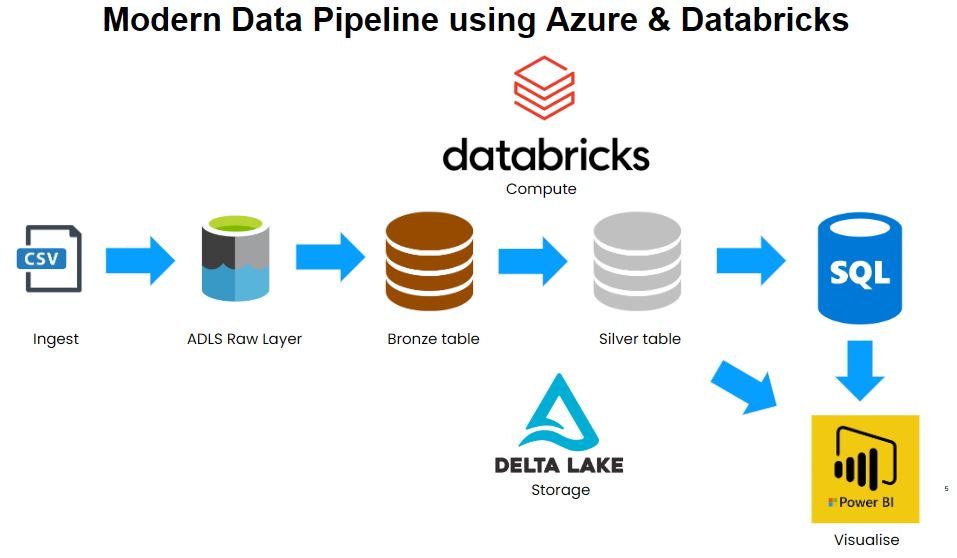

# Azure Databricks Integration

This repository demonstrates a structured approach to integrating Azure Databricks with Azure Data Lake Storage Gen2 and Azure SQL Database. It outlines a data pipeline that ingests raw data, processes it through bronze and silver layers, and finally writes the refined data to an Azure SQL Database.

## Project Structure

 - datasets/: Contains sample datasets for demonstration purposes.

 - 1.mount_adls_gen2.py: Script to mount Azure Data Lake Storage Gen2 to Databricks.

 - 2.create_databases.sql: SQL script to create necessary databases within Databricks.

 - 3.bronze_layer_table.py: Processes and stores raw data into the bronze layer.

 - 4.silver_layer_table.py: Transforms bronze data and stores it into the silver layer.

 - 5.silver_to_sql_database.py: Transfers data from the silver layer to an Azure SQL Database.

## Prerequisites

- Azure Subscription
- Azure Databricks Workspace
- Azure Data Lake Storage Gen2
- Azure SQL Database
- Databricks UI access
- Required credentials and access rights for mounting and DB connections

## Setup Instructions

### 1. Mount Azure Data Lake Storage Gen2

- Update `1.mount_adls_gen2.py` with:
  - Storage account name
  - Container name
  - Client ID, Tenant ID, and Secret
- Run the script in Databricks to mount the storage.

### 2. Create Databases

- Run `2.create_databases.sql` in a SQL notebook to create `bronze_db` and `silver_db`.

### 3. Bronze Layer - Raw Ingestion

- Run `3.bronze_layer_table.py` to load raw files from ADLS into a bronze table.

### 4. Silver Layer - Data Cleaning/Transformation

- Run `4.silver_layer_table.py` to apply transformations and store clean data in the silver table.

### 5. Export to Azure SQL Database

- Update `5.silver_to_sql_database.py` with your JDBC connection string, credentials, and target table info.
- Run the script to push data from the silver layer to Azure SQL DB.

### 6. Use PowerBI to create visualisations

 - Ingest data from Azure SQL DB in PowerBI and create visualisations.
